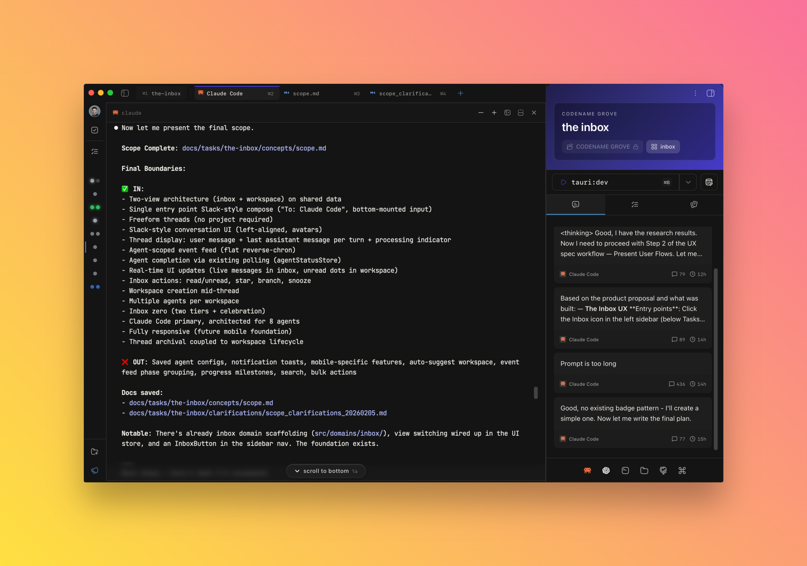

# SPECTRE

**S**cope → **P**lan → **E**xecute → **C**lean → **T**est → **R**ebase → **E**xtract

**Get higher quality results from your coding agent, while they working autonomously for much longer, so 10-100x'ing your typical output feels easy.**


## Quick Start

### Within Claude Code

```bash
# Add marketplace and install
/plugin marketplace add Codename-Inc/spectre
/plugin install SPECTRE@codename
```

Then start building:

```plaintext
/spectre:scope 
```

That's it. You just start with 1 command to build features.



## Core SPECTRE Principles

- Great Inputs -&gt; Great Outputs
- Ambiguity is Death
- One Workflow, Every Feature, Any Size, Any Codebase

## SPECTRE Purpose

AI coding is changing product development, but why is it that Claude Code can still go off the rails? Why is it that some developers claim AI has 100x'd their output, while others still complain about the quality of the code it generates?

Let me introduce you to a very simple concept that you need to drill into your head. With coding agents:

> ### **AMBIGUITY IS DEATH.**

When the scope, ux, and plan are ambiguous, you must rely on the LLM to fill in the blanks. And while sometimes you can get lucky - especially for smaller features - for any *real* technology or product work, ambiguity is how you end up with spaghetti code, conflicts, and AI slop.

LLMs need specificity. And typically, providing the right level of specificity is HARD.

BUT --- you can use LLMs to make it EASY to provide that specificity. And that is exactly what SPECTRE does.

### Workflows = Easy Button

Prompt based workflows are how you get the best, highest quality, and most consistent results from AI Coding Agents.

They provide the necessary context, detail, and structure for the agent to ask the right questions, investigate the right details, and generate the right requirements, plans, tasks, code, tests, and more.

The better your prompt based workflows, the lower the ambiguity, the more AI can take on, the longer AI can work autonomously, the more easily you can multi-task, and suddenly you are 100x'ing your output.

The path to 100x output is through **structured workflows**.

### So.... Waterfall?  

No its not. Its an entirely new way to build products.

Specificity up front forces clarity, reduces ambiguity, and leads to better 1st pass results.

THEN -- you can iterate on the feature set, ux, architecture, etc. at lightning speed. AI coding agents are 10x better at working around *working* existing code. Its why they are so good at refactors. Because they are working with a working established baseline.

**Worflows make it easier and faster to get to working code.**

From there, you can iterate and adapt before you ship.

## Background & Philosophy

## About

SPECTRE is the result of over 12 months of daily Claude Code use.

These are the *actual* prompts I use and iterate upon non stop every day to build products.

With SPECTRE, I built a React Native based AI Agent + GPS Rangefinder for Golfers (New June (in closed Alpha)) and a 250k line Tauri/Rust/React desktop application called Subspace (in open Beta - https://www.subspace.build).

## Why

I created SPECTRE because I wanted:

- a repeatable daily driver workflow that works on brand new projects, and large existing codebases.

- a single workflow that works on both small & big features without being overwhelmed with process

- a workflow that delivers robust engineering plans when needed, or a concise set of tasks if not

- hands on planning but hands off execution

- higher quality INPUT with LESS WORK so i can ensure the outputs are more aligned with my vision

- a workflow that lets Agents learn my codebase, features, patterns, bugs, so I don't have to remember everything

- ***stupid. simple. memory.*** agent sessions are aware of the ongoing thread of work (/spectre:handoff)

### My Iteration Process

I improve these prompts daily, and I didn't just prompt Claude Code to generate these prompts. I iterated over many months, adjusting the prompts based on both the user experience of using them, and the quality of results that I got.

For example:

- I iterated on /spectre:scope until I felt like the types of questions actually help me get clear on what I'm building, without asking questions that it could easily get from codebase research
- I iterated on the /spectre:execute workflow until it successfully delivered large tasks in a single context window using subagents that deliver completion reports to handoff to the next subagents, use TDD effectively, and autonomously adapt the tasks based on what was discovered DURING development instead of blindly
- I iterated on the /spectre:clean and /spectre:test workflows until it felt automatic that we were sticking to our linting rules, every new feature was well tested/covered, the commits were grouped logically with the appropriate amount of detail.
- I iterated on the /spectre:extract learnings extraction workflow until 1) the agent automatically reached for the skills generated at the start of every conversation, 2) extracted the *right* details and insights, and 3) proactively updated relevant skills as we make changes and learn more.
- I iterated on the /spectre:handoff workflow until the status update had the appropriate detail/context, and worked perfectly if I'm working across MANY sessions or just one.

SPECTRE made products like New June and Subspace possible, and it is making it possible for me, an ex-Meta, ex-Amazon Technical Product Manager to build, ship, and iterate on products 100x the complexity of anything I've ever built in the past.

## The SPECTRE Workflow

If you start with /scope, your agent will guide you through the rest of the steps automatically.

| Phase | Command | What It Does |
| --- | --- | --- |
| **S**cope | `/spectre:scope` | Define requirements, constraints, success criteria |
| **P**lan | `/spectre:plan` | Research codebase, create implementation plan |
| **E**xecute | `/spectre:execute` | Parallel implementation with wave-based delivery |
| **C**lean | `/spectre:clean` | Remove dead code, lint, format |
| **T**est | `/spectre:test` | Risk-aware test coverage |
| **R**ebase | `/spectre:rebase` | Safe merge preparation with conflict handling |
| **E**xtract | `/spectre:extract` | Capture knowledge for future sessions |

Each command ends with "Next Steps" suggestions, so you always know what prompt to run next — you don’t have to remember what the prompts are, which is one thing that kills me about many other Spec Driven Development workflows.

You can use *any* of the commands in any sequence you want - they are good standalone too. More on my typical daily usage below.

## SPECTRE Session Memory

SPECTRE maintains and accumulates context across sessions when you use the /spectre:handoff command. To get the most from SPECTRE's Session Memory, we recommend that you:

1. turn off auto-compact in Claude Code /config settings, and

2. run /spectre:handoff liberally when you are switching gears or the context window is getting north of 160k tokens.

### How It Works

When you run /spectre:handoff, a status report will get generated for that session, and automatically loaded into your context window for the next session. You’ll see a nice summary of the status when you run /clear.

If you already had previous sessions, a subagent (@spectre:sync) will review the last 3 status updates and merge into a single continuous session memory.

Voila -- trailing 3 session memory snapshots.

If you want to start fresh — /spectre:forget archives the session_logs.

```plaintext
/spectre:handoff   # Save progress before session ends
/spectre:forget    # Clear memory for fresh start
```

## SPECTRE Extract

The more I used SPECTRE and the faster I could build, the more frequently I found myself wanting to reference past work. Whether that was a hard-won debugging session, a new architectural pattern, or just documenting a feature and how it worked.

SPECTRE Extract solves this by turning your working knowledge into **persistent, auto-loading skills** that Claude reaches for in future sessions without you having to remember or re-explain anything.

### What Gets Captured

| Category | Example |
| --- | --- |
| **Gotchas** | "The websocket reconnect silently fails if..." |
| **Decisions** | "We chose SQLite over Postgres because..." |
| **Features** | Architecture dossiers — key files, flows, common tasks |
| **Patterns** | Reusable solutions established across the codebase |
| **Procedures** | Multi-step processes like deploy, release, migrate |

### How It Works

Run `/spectre:extract` after any session where you learned something worth keeping. SPECTRE analyzes the conversation, proposes what to capture, and on approval writes it as a project-scoped skill with trigger words.

```plaintext
/spectre:extract     # Capture knowledge from this session
/spectre:recall auth # Find and load existing knowledge about auth
```

### The Hook + Skill Loop

What is great about SPECTRE Extract, is that Claude Code automatically loads skills that are relevant. We do this with a 'coercion' technique I borrowed from Jesse Vincent’s great Superpowers skill.

1. **SessionStart hook** — every time you start a conversation, SPECTRE's hook reads your project's knowledge registry and injects it into context. Claude now *knows what it knows* before you type a single word.

2. **Skill auto-loading** — when your task matches a trigger word from the registry (e.g., you mention "auth" and there's a `feature-auth-flows` skill), Claude loads the full skill *before* searching the codebase. No wasted tool calls rediscovering what's already documented.

The result: knowledge compounds across sessions instead of resetting to zero. The more you extract, the faster and more accurate every future session becomes.

## Subagents

SPECTRE dispatches specialized subagents for different tasks:

NOTE: You don’t even need to know that these subagents exist. The prompts instruct Claude Code to call them automatically.

Although I do sometimes use @spectre:web-research for web research. It's like mini deep-research.

| Agent | Purpose |
| --- | --- |
| `@spectre:dev` | Implementation with MVP focus |
| `@spectre:analyst` | Understand how code works |
| `@spectre:finder` | Find where code lives |
| `@spectre:patterns` | Find reusable patterns |
| `@spectre:web-research` | Web research |
| `@spectre:tester` | Test automation |
| `@spectre:reviewer` | Independent code review |

## How I Typically use SPECTRE

99.9% of my day is spent using SPECTRE exactly like this.

- start /spectre:scope to get crisp on what’s in/out. this is non-negotiable unless the feature is a one line ask.

- /spectre:plan to build out a well researched technical design or set of tasks

  - once i have scope/plan/tasks, I typically run /spectre:handoff to get a fresh context window with awareness of what we’re working on.

- then run /spectre:execute to use parallel subagents to work through the tasks. Execute is a meta prompt that also calls /spectre:code_review and /spectre:validate.

  - side note /spectre:validate is a killer prompt. It breaks down the original tasks and dispatches subagents to verify. find stuff missing all the time with this.

  - when initial execution is complete, i run another /spectre:handoff to get the context window clean for fixes/touch ups.

- From here — I do a bunch of manual testing and fixing.

  - I largely use Claude Code's built in /plan mode for fixes in this phase.

  - If there is a bug that can't easily be solved, i use the /spectre:fix prompt for a more structured debugging approach.

  - If something new comes up, or if the scope is not what I’d hoped, I run a new /scope cycle from within the project.

  - I liberally use /spectre:handoff here to keep context windows clean as I work through issues, and keep the sessions on track with the progress we're making.

- During the process of manual testing/fixing, I typically accumulate uncommitted changes. /spectre:sweep will get your changes committed, while

  - running and addressing lint
  - running tests and related tests on touched files
  - finding obvious dead code/AI slop, and
  - grouping changes logically with descriptive conventional commits

- Once wrapping up, /spectre:clean is a much deeper cleanup that dispatches subagents to find dead code, duplicates, verifies, lint, commits any stragglers, etc.

- Then /spectre:test does deep analysis and dispatches subagents to write tests based on a risk-adjusted framework focusing on behavior not implementation details.

- Once cleaned/tested — /spectre:rebase works great to rebase onto your parent branch, but obviously you do you with your release flow. From here I create PR/merge or directly merge depending on the task.

- Finally, I run /spectre:extract to capture any knowledge worth preserving — patterns, gotchas, decisions. This builds institutional memory that loads automatically in future sessions.

## Slash Command Reference

### Core Workflow

| Command | Description |
| --- | --- |
| `/spectre:scope` | Interactive feature scoping |
| `/spectre:plan` | Research codebase, create implementation plan |
| `/spectre:execute` | Wave-based parallel execution with code review |
| `/spectre:clean` | Code cleanup and quality gates |
| `/spectre:test` | Risk-aware test coverage |
| `/spectre:rebase` | Safe rebase with conflict handling |
| `/spectre:extract` | Capture knowledge for future sessions |

### Quick Start

| Command | Description |
| --- | --- |
| `/spectre:quick_dev` | Scope + plan for small/medium tasks |

### Discovery & Research

| Command | Description |
| --- | --- |
| `/spectre:kickoff` | Deep research for high-ambiguity features |
| `/spectre:research` | Parallel codebase research |

### Session Memory

| Command | Description |
| --- | --- |
| `/spectre:handoff` | Save session state snapshot |
| `/spectre:forget` | Clear memory, archive logs |

### Utilities

These are situational commands.

I use /spectre:fix for pretty much all bugs I run into.

| Command | Description |
| --- | --- |
| `/spectre:sweep` | Light cleanup pass — lint, test, descriptive commits |
| `/spectre:ux_spec` | UX specification for UI-heavy features |
| `/spectre:fix` | Investigate bugs & implement fixes |

## Repository Structure

```plaintext
spectre/
├── .claude-plugin/
│   └── marketplace.json  # Marketplace registration
├── plugins/
│   └── spectre/
│       ├── .claude-plugin/
│       │   └── plugin.json   # Plugin manifest
│       ├── commands/         # Slash commands
│       ├── agents/           # Subagent definitions
│       ├── hooks/            # Session memory hooks
│       └── skills/           # Skills
├── scripts/              # Release & utility scripts
└── CLAUDE.md
```

## License

MIT